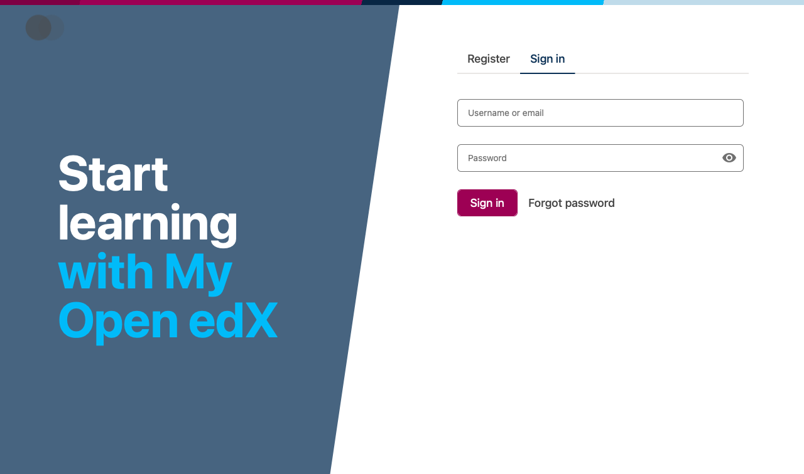
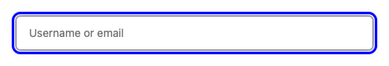
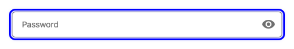
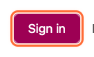
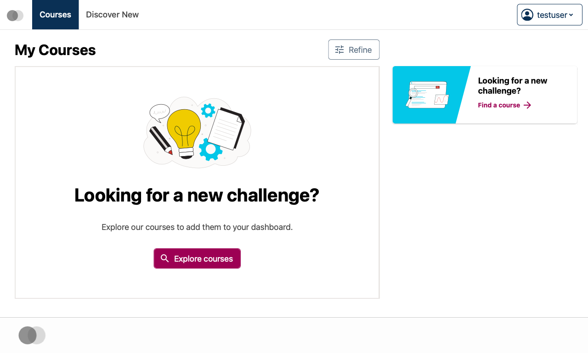
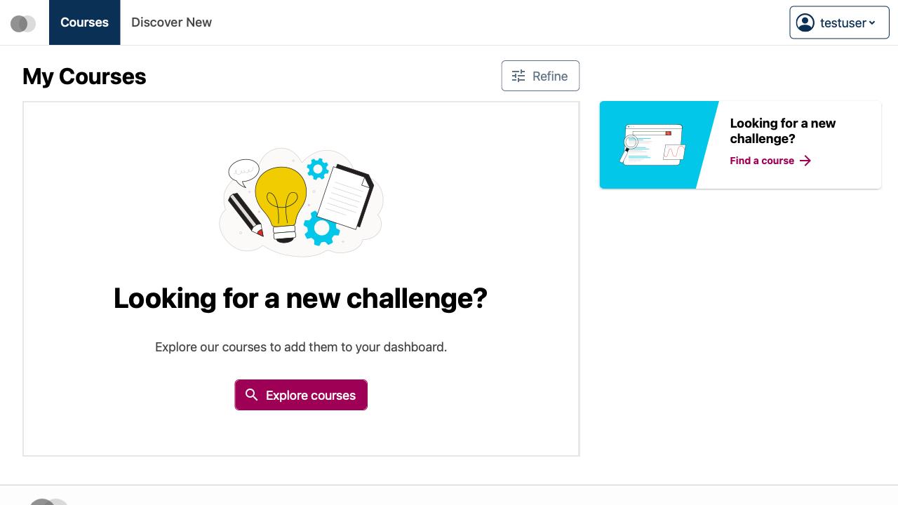

# How to Log In to Your Open edX Account

This guide explains how to log in to your Open edX account. Once you log in, you can access your enrolled courses, track your progress, and manage your account settings.

## Prerequisites

Before you begin, ensure that:

- You have created an Open edX account
- You have your email address or username and password ready
- Your web browser has JavaScript enabled

> **Note:** If you forgot your password, use the "Forgot Password" link on the login page to reset it.

## Steps

To complete this process, follow these steps:

### 1. Navigate to the Open edX login page

You can access the login page by clicking "Sign In" from the main Open edX website or by going directly to the login URL.

### 2. Locate the login form

The form contains two main fields: an email/username field and a password field, along with a "Sign In" button.

### 3. Enter your email or username

Enter either the email address you registered with or your chosen username in the first field.

> **Note:** If you are unsure which one to use, try the email address you used when creating your account first.

### 5. Enter your password

Type your password in the password field.

> **Note:** Your password is case-sensitive, so make sure your Caps Lock is in the correct position.

### 7. Click the "Sign In" button

This will submit your login credentials and access your account.

### 9. Access your dashboard

After successful login, you will be automatically redirected to your dashboard where you can view your enrolled courses, progress, and account information.

### 10. Main dashboard area highlighted

This is the main content area where you can see your courses and progress.

### 11. Explore your account options

From the dashboard, you can navigate to different sections like My Courses, Account Settings, or Profile.

> **Note:** Look for navigation menus or buttons to access different features.

## Related Topics

- [Creating an Open edX Account](#creating-account)
- [Resetting Your Password](#reset-password)
- [Account Settings and Profile Management](#account-settings)
- [Course Enrollment](#course-enrollment)

---

*This documentation was automatically generated during testing.*
