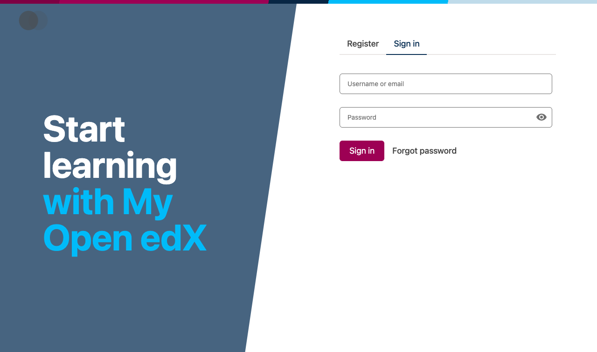
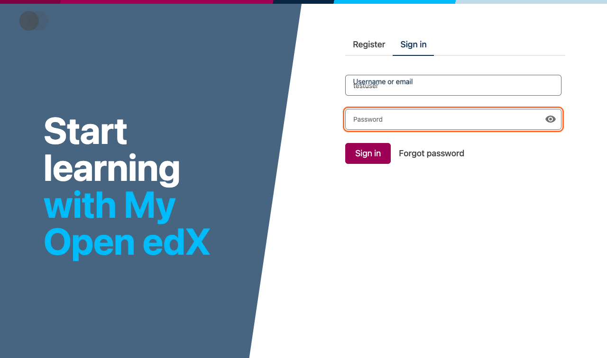
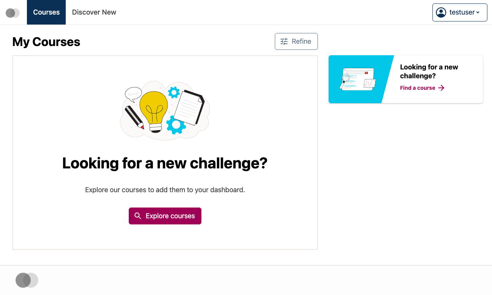

How to Log In to Your edX Account
=================================

This documentation was automatically generated during testing.

Step 1: You can access the login page by clicking 'Sign In' from the main edX website or by going directly to the login URL.
----------------------------------------------------------------------------------------------------------------------------

Step 2: The form contains two main fields: an email/username field and a password field, along with a 'Sign In' button.
-----------------------------------------------------------------------------------------------------------------------

.. image:: step-02.png
   :alt: Step 2

Step 3: Enter either the email address you registered with or your chosen username in the first field.
------------------------------------------------------------------------------------------------------

Step 4: Type your password in the password field.
-------------------------------------------------

Step 5: This will submit your login credentials and access your account.
------------------------------------------------------------------------

Step 6: After successful login, you will be automatically redirected to your dashboard where you can view your enrolled courses, progress, and account information.
-------------------------------------------------------------------------------------------------------------------------------------------------------------------

