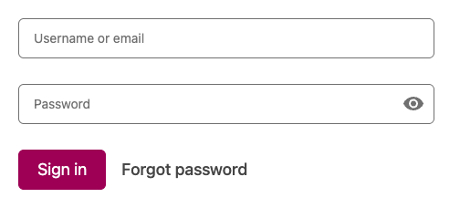
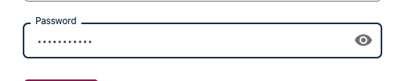

# How to Login to Open edX

This documentation was generated from a markdown test file.

## Steps

To complete this process, follow these steps:

### 1. How to Login to Open edX

This guide shows you how to log into your Open edX account step by step.

### 2. Navigate to Login Page

Go to the login page from the main website. You can access this by clicking the "Sign In" button.

### 3. Login page loaded

The Open edX login page is displayed

### 4. Locate the Login Form

Find the login form on the page. It contains an email field, password field, and Sign In button.

### 5. Login form visible

The login form with all required fields

### 6. Enter Your Email

Click on the email field and enter your email address or username.

### 7. Email entered

Email address filled in the email field

### 8. Enter Your Password

Click on the password field and type your password carefully.

### 9. Password entered

Password filled in (shown as dots for security)

### 10. Click Sign In

Click the "Sign In" button to submit your login credentials.

### 11. Access Your Dashboard

After successful login, you'll be redirected to your personal dashboard. You can now access your courses, account settings, and other features from the dashboard.

### 12. Dashboard loaded

Successfully logged in and viewing your dashboard

---

*This documentation was automatically generated during testing.*
