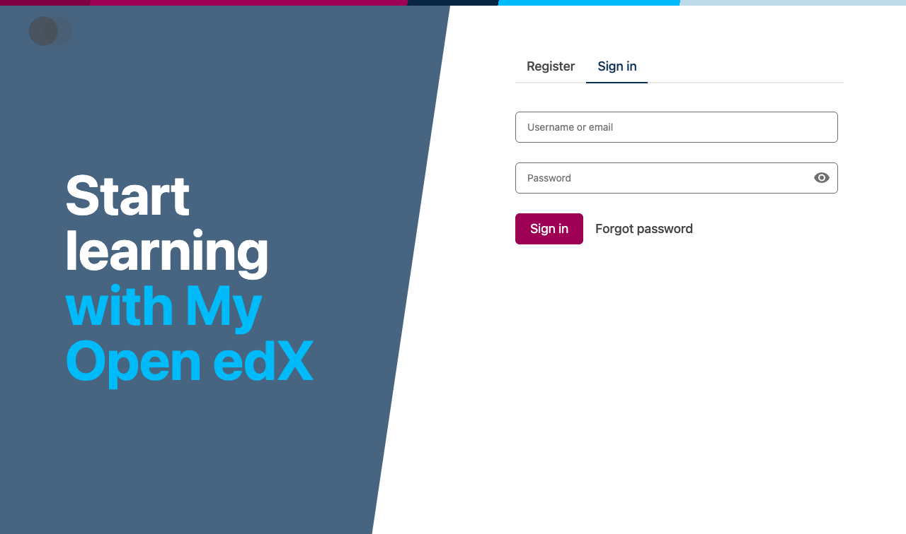
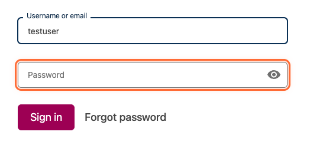
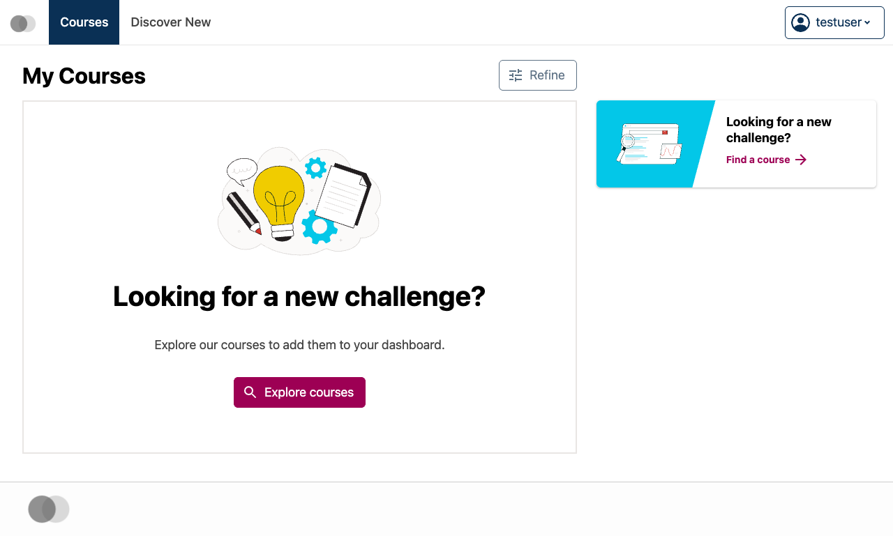

# How to Login to Open edX

This comprehensive guide demonstrates the complete login process for Open edX, showcasing all the key user interface elements and interactions you'll encounter.

## Getting Started

Before you begin the login process, make sure you have your account credentials ready. You'll need either your email address or username, along with your password.

### What You'll Need

To successfully complete this login tutorial, ensure you have:

- A valid Open edX account (if you don't have one, you'll need to register first)
- Your email address or username
- Your account password
- A modern web browser with JavaScript enabled
- Stable internet connection

## Navigate to the Login Page

The first step is accessing the Open edX login page. You can reach this page in several ways:

- Click the "Sign In" button from the main Open edX website
- Navigate directly to the login URL
- Follow a login link from an email invitation
- Access it through a course enrollment link

### 1. Login page loaded

The Open edX login page is displayed with all necessary form elements




The login page provides a clean, professional interface designed for easy access to your learning environment.

## Understanding the Login Form

The login form is the central element of the page and contains all the fields you need to authenticate. Take a moment to familiarize yourself with its layout and components.

### Form Components

The login form includes several important elements:

- **Email/Username field**: Where you enter your login identifier
- **Password field**: For your secure password entry
- **Sign In button**: To submit your credentials
- **Forgot Password link**: For password recovery if needed
- **Remember me option**: To stay logged in longer (if available)

### 2. Login form overview

Complete view of the login form showing all input fields and buttons


## Enter Your Credentials

Now you'll provide your account information to authenticate with the system.

### Step 1: Enter Your Email or Username

Click on the email field and carefully enter your login identifier. This can be either the email address you used when registering or your chosen username.

### 3. Enter your email or username

Type your login identifier in the email/username field


**Pro Tip**: If you're unsure whether to use your email or username, try your email address first as it's the most commonly used identifier.

### Step 2: Enter Your Password

Next, click on the password field and enter your account password. Make sure to type it exactly as you created it, paying attention to capitalization and special characters.

### 5. Enter your password

Type your secure password in the password field




**Security Note**: Your password will appear as dots or asterisks for security. This prevents others from seeing your password if they're looking at your screen.

**Important Reminder**: Passwords are case-sensitive, so make sure your Caps Lock key is in the correct position before typing.

## Submit Your Login Information

With your credentials entered, you're ready to authenticate and access your account.

### Click the Sign In Button

Locate the "Sign In" button (usually prominently displayed) and click it to submit your login information to the server.

### 7. Click the Sign In button

Submit your credentials by clicking the Sign In button


The system will now verify your credentials. This process typically takes just a few seconds.

### Authentication Process

During authentication, the system:

1. Verifies your email/username exists in the database
2. Checks that your password matches the stored hash
3. Validates your account status (active, not suspended, etc.)
4. Creates a secure session for your browser
5. Redirects you to your dashboard or intended destination

### Authentication completed

Your credentials have been verified and you are being redirected


## Welcome to Your Dashboard

Congratulations! You've successfully logged into your Open edX account. You should now see your personalized dashboard.

### Dashboard Overview

Your dashboard is the central hub for your learning experience. From here, you can:

- **View enrolled courses**: See all courses you're currently taking
- **Track progress**: Monitor your completion status and grades
- **Access account settings**: Update your profile and preferences
- **Explore new courses**: Browse the course catalog
- **View announcements**: Stay updated with important information
- **Manage notifications**: Control how you receive updates

### 9. Dashboard successfully loaded

Your personalized Open edX dashboard showing available courses and account options




### Navigation Options

From your dashboard, you can easily navigate to different sections:

- **My Courses**: Access your enrolled courses and continue learning
- **Discover New**: Browse available courses and programs
- **Account**: Manage your profile, settings, and preferences
- **Help**: Access support resources and documentation

### Next Steps

Now that you're logged in, you can:

1. **Continue your learning**: Resume where you left off in your courses
2. **Explore new content**: Browse additional courses that interest you
3. **Update your profile**: Add information to personalize your experience
4. **Connect with others**: Join discussions and interact with fellow learners
5. **Track your progress**: Review your achievements and course completion status

## Troubleshooting Common Issues

If you encounter problems during login, here are some common solutions:

### Forgot Your Password?

If you can't remember your password:
1. Click the "Forgot Password" link on the login page
2. Enter your email address
3. Check your email for reset instructions
4. Follow the link to create a new password

### Account Locked or Suspended?

If your account is locked:
- Contact your institution's support team
- Provide your username/email for assistance
- Be prepared to verify your identity

### Browser Issues?

Try these steps if the page isn't working correctly:
- Clear your browser cache and cookies
- Disable browser extensions temporarily
- Try using an incognito/private browsing window
- Update your browser to the latest version

## Security Best Practices

To keep your account secure:

- **Use a strong password**: Combine letters, numbers, and special characters
- **Don't share credentials**: Keep your login information private
- **Log out when finished**: Especially on shared computers
- **Update regularly**: Change your password periodically
- **Monitor activity**: Review your account for unusual activity

You're now ready to make the most of your Open edX learning experience!

---

## Markdown Formatting Examples

This section demonstrates all markdown formatting elements to ensure the parser handles them correctly.

### Basic Text Formatting

Here we show **bold text** and *italicized text* along with `inline code` examples.

> This is a blockquote that provides important information about the login process.
> It can span multiple lines and provides emphasis for critical details.

### Lists and Organization

#### Ordered List Example
1. First step in the process
2. Second step with detailed explanation
3. Third step that completes the workflow

#### Unordered List Example
- Primary navigation option
- Secondary menu item
- Additional feature access
  - Nested sub-item
  - Another nested option

### Code Examples

Here's an inline `code snippet` and a fenced code block:

```json
{
  "username": "student@example.com",
  "loginStatus": "authenticated",
  "sessionTimeout": 3600,
  "preferences": {
    "theme": "light",
    "notifications": true
  }
}
```

### Links and References

Visit the [Open edX Documentation](https://docs.openedx.org) for more information.

You can also reference internal links like [Getting Started](#getting-started) section above.

### Tables

| Feature | Availability | Description |
|---------|-------------|-------------|
| Single Sign-On | ✅ Available | Login with external accounts |
| Two-Factor Auth | ⚠️ Optional | Enhanced security feature |
| Password Reset | ✅ Available | Self-service password recovery |
| Account Lock | ✅ Available | Security protection mechanism |

### Task Management

Login process checklist:
- [x] Navigate to login page
- [x] Enter credentials
- [x] Submit form
- [ ] Complete profile setup
- [ ] Enroll in first course

### Advanced Formatting

#### Definition Lists
Authentication
: The process of verifying user identity through credentials

Session Management
: Maintaining user state across multiple page requests

#### Text Modifications

~~Old login method~~ is now replaced with the new streamlined process.

Important chemical formula for learners: H~2~O (water)

Mathematical expressions like E=mc^2^ are also supported.

#### Special Highlights

==This is very important information== that users should pay special attention to.

#### Emojis and Symbols

That login process was so smooth! :smile: :rocket:

Users love the new interface! :heart: :thumbsup:

#### Footnotes

The login system uses industry-standard security protocols[^1] to protect user data.

Advanced users can enable two-factor authentication[^2] for additional security.

[^1]: Including OAuth 2.0, SAML, and encrypted session management
[^2]: Available through authenticator apps or SMS verification

### Custom Heading with ID {#custom-login-section}

This heading has a custom ID that can be referenced directly in links.

---

**End of comprehensive markdown formatting demonstration**