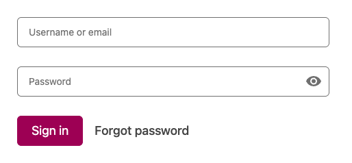
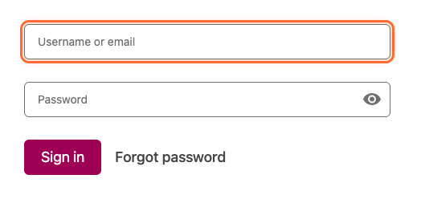
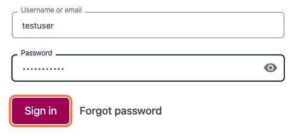

How to Login to Open edX
========================

This documentation was generated from a markdown test file.

Steps
=====

To complete this process, follow these steps:

1. How to Login to Open edX
---------------------------

This comprehensive guide demonstrates the complete login process for Open edX, showcasing all the key user interface elements and interactions you'll encounter.

2. Getting Started
------------------

Before you begin the login process, make sure you have your account credentials ready. You'll need either your email address or username, along with your password.

3. Navigate to the Login Page
-----------------------------

The first step is accessing the Open edX login page. You can reach this page in several ways: - Click the "Sign In" button from the main Open edX website - Navigate directly to the login URL - Follow a login link from an email invitation - Access it through a course enrollment link The login page provides a clean, professional interface designed for easy access to your learning environment.

4. Login page loaded
--------------------

The Open edX login page is displayed with all necessary form elements

.. image:: step-04.png
   :alt: Step 4

5. Understanding the Login Form
-------------------------------

The login form is the central element of the page and contains all the fields you need to authenticate. Take a moment to familiarize yourself with its layout and components.

6. Login form overview
----------------------

Complete view of the login form showing all input fields and buttons

7. Enter Your Credentials
-------------------------

Now you'll provide your account information to authenticate with the system.

8. Enter your email or username
-------------------------------

Type your login identifier in the email/username field

9. Enter your password
----------------------

Type your secure password in the password field

.. image:: step-09.png
   :alt: Step 9

10. Submit Your Login Information
---------------------------------

With your credentials entered, you're ready to authenticate and access your account.

11. Click the Sign In button
----------------------------

Submit your credentials by clicking the Sign In button

12. Authentication completed
----------------------------

Your credentials have been verified and you are being redirected

13. Welcome to Your Dashboard
-----------------------------

Congratulations! You've successfully logged into your Open edX account. You should now see your personalized dashboard.

14. Dashboard successfully loaded
---------------------------------

Your personalized Open edX dashboard showing available courses and account options

.. image:: step-14.png
   :alt: Step 14

15. Troubleshooting Common Issues
---------------------------------

If you encounter problems during login, here are some common solutions:

16. Security Best Practices
---------------------------

To keep your account secure: - **Use a strong password**: Combine letters, numbers, and special characters - **Don't share credentials**: Keep your login information private - **Log out when finished**: Especially on shared computers - **Update regularly**: Change your password periodically - **Monitor activity**: Review your account for unusual activity You're now ready to make the most of your Open edX learning experience! ---

17. Markdown Formatting Examples
--------------------------------

This section demonstrates all markdown formatting elements to ensure the parser handles them correctly.

----

*This documentation was automatically generated during testing.*
