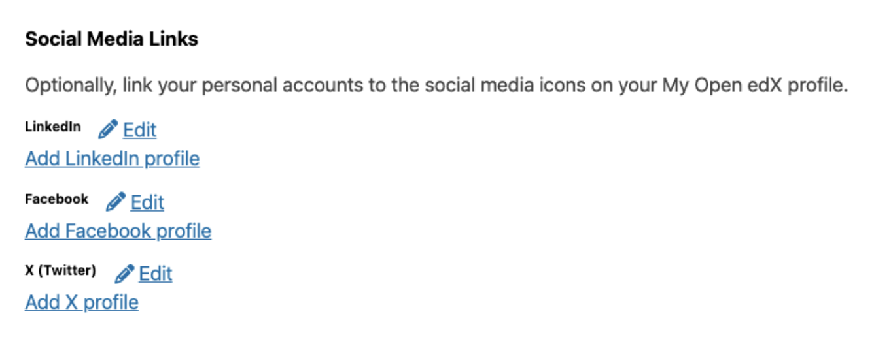
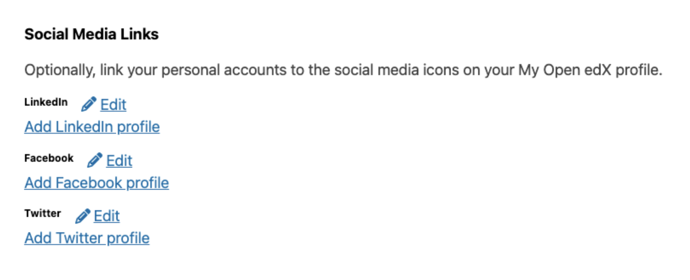
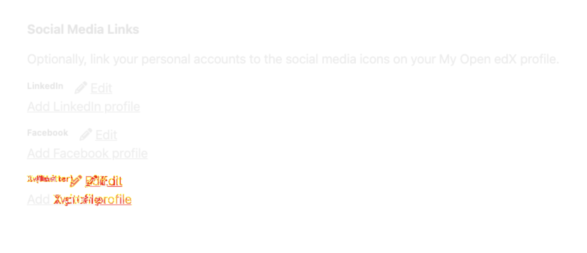

# Visual Regression Testing Guide

## Overview

The visual regression utility uses `pixelmatch` to perform pixel-by-pixel comparison of screenshots. It captures baseline images, stores them in version control, and generates diff images with red highlights showing exactly which pixels changed between runs.

## Installation

```bash
npm install openedx-e2e-tests
```

## How It Works

1. **First run**: Generates baseline screenshots stored in `tests/__visual-baselines__/{browser}/{test-name}/` (tracked in git)
2. **Subsequent runs**: Captures current screenshots and compares pixel-by-pixel against baselines using `pixelmatch`
3. **On differences**: Generates diff images with **red highlights** showing changed pixels
   - Gray pixels = unchanged
   - Bright red pixels = changed (major differences)
   - Light red pixels = subtle differences
4. **All artifacts**: Current screenshots and diffs are saved to `artifacts/visual-regression/` (gitignored)







## Usage

### Basic Example

```typescript
import { test } from '@playwright/test';
import { VisualRegression } from 'openedx-e2e-tests';

test('my visual test', async ({ page }, testInfo) => {
  const vr = new VisualRegression(page, testInfo);

  await page.goto('/dashboard');

  // Capture and compare
  await vr.captureAndCompare({
    name: 'dashboard-view',
    fullPage: true,
  });
});
```

### Convenience Function

```typescript
import { assertVisualRegression } from 'openedx-e2e-tests';

test('quick visual test', async ({ page }, testInfo) => {
  await page.goto('/dashboard');

  await assertVisualRegression(page, testInfo, {
    name: 'dashboard-view',
    fullPage: true
  });
});
```

### In This Repository (Examples)

If you're working with the example tests in this repository:

```typescript
import { VisualRegression } from '../../src';
```

### Masking Dynamic Content

To avoid false positives from timestamps, user-specific data, or animations:

```typescript
await vr.captureAndCompare({
  name: 'dashboard-after-login',
  fullPage: true,
  mask: [
    '.timestamp',
    '[data-testid="user-greeting"]',
    '.last-login-time',
  ],
});
```

### Adjusting Sensitivity

Control how strict the comparison is with the `threshold` parameter (0-1):

```typescript
await vr.captureAndCompare({
  name: 'login-page',
  threshold: 0.15,  // Allow 15% brightness diff per pixel (default: 0.1)
});
```

**Threshold values:**
- `0.1` (default) - Standard sensitivity, good for catching meaningful changes
- `0.15` - More lenient, tolerates minor anti-aliasing and font rendering differences
- `0.05` - Very strict, will flag subtle differences

The threshold controls how different a pixel's RGB values can be before it's considered "changed". Lower values are more strict.

## Workflow

### 1. Generate Baselines (First Run)

```bash
# Run the test to generate baselines
npm run test tests/auth/login.spec.ts

# Baselines are created in tests/__visual-baselines__/
# Commit these to version control
git add tests/__visual-baselines__/
git commit -m "Add visual regression baselines for login flow"
```

### 2. Run Visual Regression Tests

```bash
# Run normally - will compare against baselines
npm test

# Or run specific test
npm run test tests/auth/login.spec.ts
```

### 3. Review Failures

When visual tests fail:

1. Check `artifacts/visual-regression/{browser}/{test-name}/diff/` for red-highlighted diffs
2. Review the Playwright HTML report: `npm run report`
3. Diff images are attached to the test results

### 4. Update Baselines (Intentional Changes)

If the UI changes are intentional, you need to update the baseline. There are three approaches:

**Option 1: Delete and regenerate (recommended)**
```bash
# Delete the specific baseline you want to update
rm -rf tests/__visual-baselines__/chromium/your-test-name/

# Re-run the test - creates new baseline
npm run test tests/auth/login.spec.ts -- --project=chromium

# Commit the new baseline
git add tests/__visual-baselines__/
git commit -m "Update visual regression baseline for account page"
```

**Option 2: Use updateBaseline() method**
```typescript
// Temporarily replace captureAndCompare with updateBaseline
await vr.updateBaseline({
  name: 'account-page',
  fullPage: true,
  mask: ['.timestamp'],
});
```

**Option 3: Copy from current to baseline**
```bash
# Copy the current screenshot to baseline
cp artifacts/visual-regression/chromium/your-test-name/current/account-page.png \
   tests/__visual-baselines__/chromium/your-test-name/

# Commit
git add tests/__visual-baselines__/
git commit -m "Update visual regression baseline"
```

## Directory Structure

```
openedx-e2e-tests/
├── tests/
│   ├── __visual-baselines__/       # ✅ Tracked in git
│   │   ├── chromium/
│   │   │   └── {test-name}/
│   │   │       ├── login-page-initial.png
│   │   │       └── dashboard-after-login.png
│   │   ├── firefox/
│   │   └── webkit/
│   └── auth/
│       └── login.spec.ts
├── artifacts/
│   └── visual-regression/          # ❌ Gitignored
│       ├── chromium/
│       │   └── {test-name}/
│       │       ├── current/        # Current run screenshots
│       │       └── diff/           # Red-highlighted diff images
│       ├── firefox/
│       └── webkit/
```

## CI Integration

### GitHub Actions Example

```yaml
- name: Run visual regression tests
  run: npm test

- name: Upload visual regression diffs on failure
  if: failure()
  uses: actions/upload-artifact@v3
  with:
    name: visual-regression-diffs
    path: artifacts/visual-regression/**/diff/*.png

- name: Upload full visual regression artifacts
  if: always()
  uses: actions/upload-artifact@v3
  with:
    name: visual-regression-results
    path: artifacts/visual-regression/
```

## Best Practices

### 1. Wait for Stability

Always wait for animations and network activity to complete:

```typescript
await page.waitForLoadState('networkidle');
await page.waitForTimeout(500); // Let CSS transitions complete
```

### 2. Mask Dynamic Content

Identify and mask anything that changes between runs:
- Timestamps
- User greetings
- Random content
- Live data feeds

### 3. Control Viewport Size

Viewport is controlled per-project in `playwright.config.ts` via device presets, ensuring consistent screenshots across runs.

### 4. Run Visual Tests Separately in CI

Visual regression tests are sensitive to font rendering and OS differences. Consider:
- Running in containerized environments (Docker)
- Using consistent OS/browser versions
- Or running visual tests only against one browser (e.g., chromium)

```bash
# Run only chromium for visual regression in CI
npx playwright test --project=chromium
```

## Troubleshooting

### "Baseline doesn't exist" on first run

This is expected. The utility creates the baseline automatically.

### False positives from font rendering

Fonts render differently across OSes. Run tests in Docker or accept slightly higher thresholds:

```typescript
threshold: 0.03,  // 3% of pixels can differ
```

### Diffs show entire page red

Check if:
- Dynamic content isn't masked
- Network requests completed (`waitForLoadState('networkidle')`)
- Animations finished (`waitForTimeout()`)
